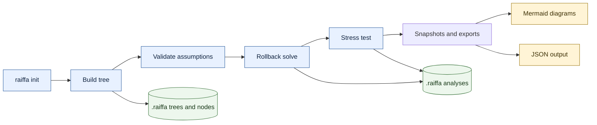
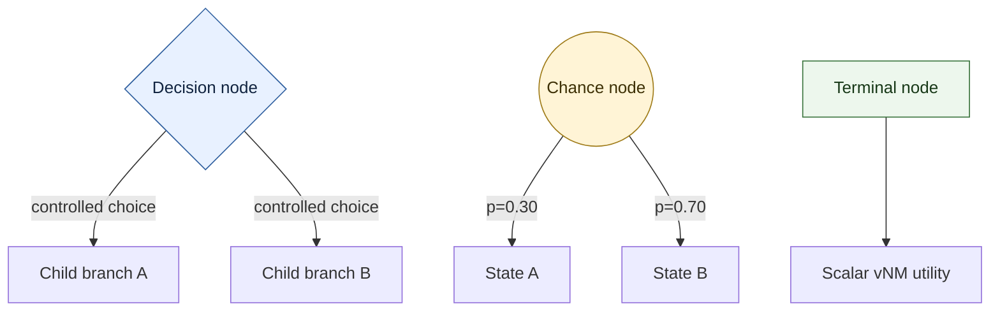
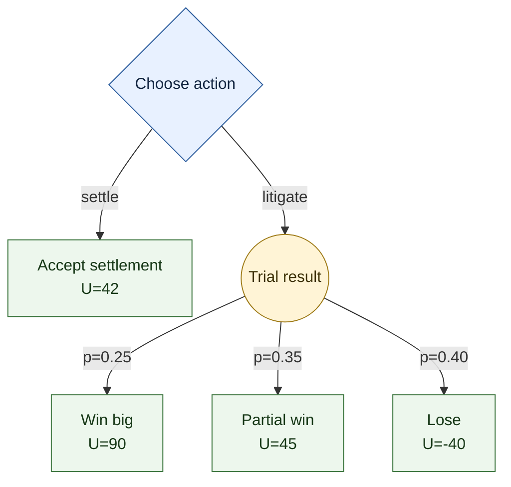
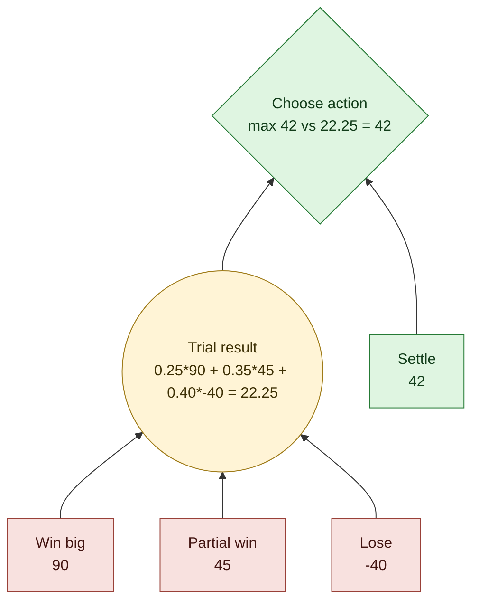
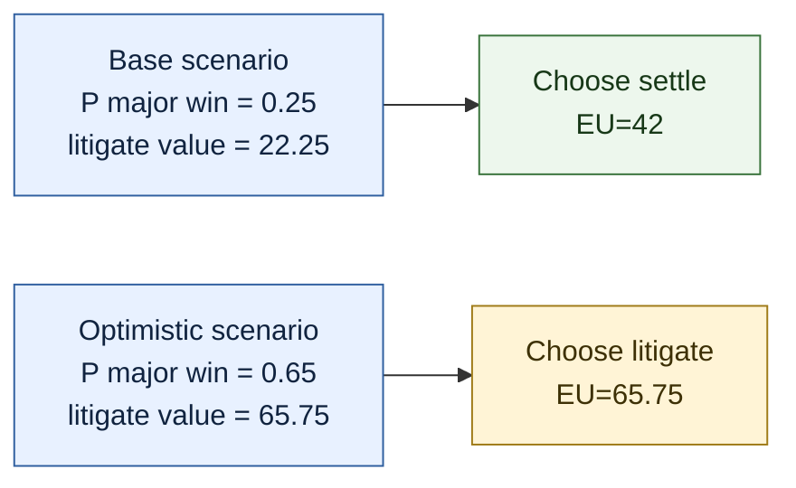
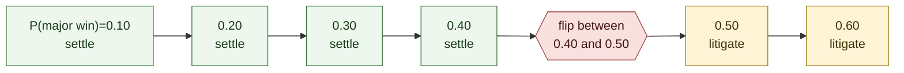
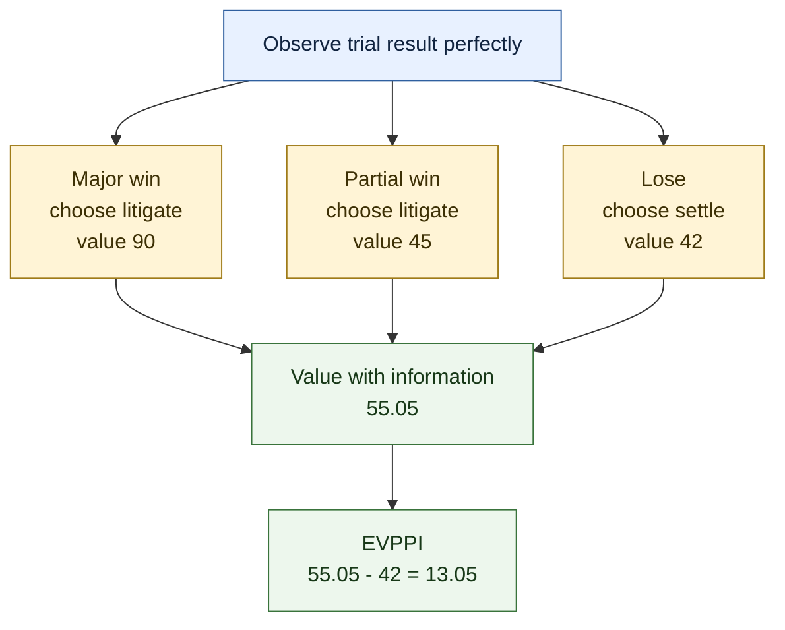
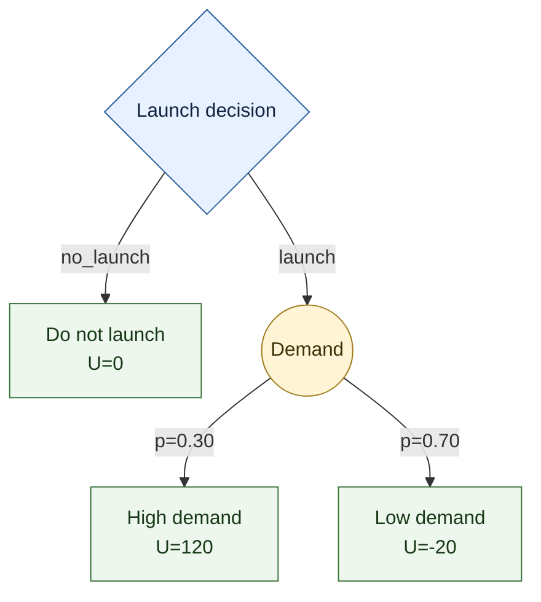
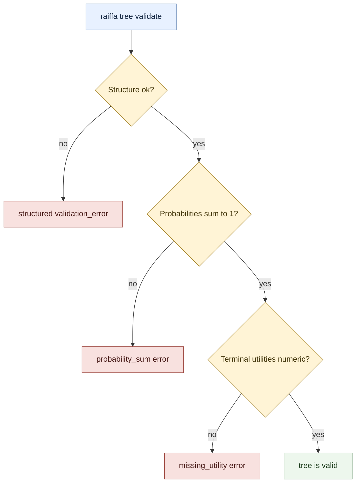

# Raiffa CLI

`raiffa` is a JSON-first command-line tool for decision analysis. It helps you build
decision trees with decision nodes, chance nodes, and terminal outcomes, assign
probabilities and von Neumann-Morgenstern utilities, then reason about the best action by
expected-utility rollback.

It is designed for agents and scripts first:

- Commands return JSON by default.
- Errors are structured JSON.
- Projects store small local JSON files under `.raiffa/`.
- Analysis runs can be saved as reproducible snapshots.
- `--human` gives concise readable output when you want it.

The CLI is modeled after `/Users/jjhorton/tools/voting`: local project storage, Typer
commands, simple domain objects, and scenario tests.

## Visual Overview

The README diagrams are Mermaid. Their source files are generated under
`docs/visuals/` by:

```bash
python scripts/create_readme_visuals.py
```



## What It Supports

V1 supports:

- Local `.raiffa/` projects.
- Decision trees with:
  - `decision` nodes for choices controlled by the decision maker.
  - `chance` nodes for nature's moves.
  - `terminal` nodes for outcomes with scalar utility.
- Probability assignment for chance-node children.
- Utility assignment for terminal nodes.
- Strict validation before solving.
- Expected-utility rollback.
- Optimal policy extraction.
- Branch-label aware recommendations.
- Scenario overrides for probabilities and utilities.
- One-way sensitivity analysis.
- Threshold detection in sensitivity sweeps.
- Expected value of partial perfect information for finite chance nodes.
- Basic EVPI wrapper over chance nodes.
- Regret and dominance reports.
- Analysis snapshots.
- Mermaid export.

V1 intentionally keeps the model small and explicit. Future work can add utility-function
fitting, probability intervals, Bayesian updating, EVSI, multiattribute utility, influence
diagrams, simulation, and richer report/export formats.

## Install

From this repository:

```bash
pip install -e .
```

After installation:

```bash
raiffa --help
```

Without installing the entrypoint, run from the repository root:

```bash
python -m raiffa.cli --help
```

## Project Model

A project is a normal directory with a `.raiffa/` data directory:

```text
example_project/
  .raiffa/
    meta.json
    trees/
    nodes/
    probabilities/
    utilities/
    scenarios/
    analyses/
    reports/
    imports/
    exports/
```

Commands discover the project by walking upward from the current directory. You can also
point directly at a project:

```bash
raiffa --project /path/to/example_project info
```

## Output Contract

JSON is the default:

```json
{
  "data": {},
  "warnings": []
}
```

Errors are JSON on stderr:

```json
{
  "error": {
    "code": "validation_error",
    "message": "Tree validation failed.",
    "details": {}
  }
}
```

Use `--human` for short readable output:

```bash
raiffa --human solve product_launch --no-write
```

Example:

```text
launch with expected utility 22.0
```

## Core Concepts

### Trees

A tree is one decision-analysis model. It has one root node.

```bash
raiffa tree add lawsuit "Settle or Litigate"
```

### Decision Nodes

A decision node represents a choice controlled by the decision maker. The solver chooses
the child branch with maximum expected utility.

```bash
raiffa node add-decision lawsuit root "Choose action"
```

### Chance Nodes

A chance node represents nature's move. Each child must have a probability, and the
probabilities must sum to `1.0`.

```bash
raiffa node add-chance lawsuit trial_result "Trial result" \
  --parent root \
  --branch-label litigate

raiffa prob set lawsuit trial_result win_big=0.25 partial_win=0.35 lose=0.40
```

### Terminal Nodes

A terminal node represents an outcome. V1 requires a scalar utility.

```bash
raiffa node add-terminal lawsuit settle_outcome "Accept settlement" \
  --parent root \
  --branch-label settle \
  --utility 42
```

### Node IDs vs Branch Labels

The CLI keeps stable node IDs for scripts and branch labels for human interpretation.

For example, the product-launch tree uses:

- node ID: `demand`
- branch label: `launch`

Solve output includes both:

```json
{
  "recommended_action": "demand",
  "recommended_branch_label": "launch"
}
```

Use `recommended_action` when you need a stable node reference. Use
`recommended_branch_label` when showing the recommendation to a person.

### Visual Node Legend



## Command Overview

Project commands:

```bash
raiffa init <project_id> [--title TEXT] [--description TEXT]
raiffa info
```

Tree commands:

```bash
raiffa tree add <tree_id> <name>
raiffa tree list
raiffa tree show <tree_id>
raiffa tree validate <tree_id>
raiffa tree status <tree_id> <draft|ready|locked|archived>
raiffa tree delete <tree_id>
```

Node commands:

```bash
raiffa node add-decision <tree_id> <node_id> <label>
raiffa node add-chance <tree_id> <node_id> <label> --parent NODE --branch-label TEXT
raiffa node add-terminal <tree_id> <node_id> <label> --parent NODE --branch-label TEXT --utility FLOAT
raiffa node list <tree_id>
raiffa node show <tree_id> <node_id>
raiffa node move <tree_id> <node_id> --parent NODE --branch-label TEXT
raiffa node rename <tree_id> <node_id> <label>
raiffa node annotate <tree_id> <node_id> --note TEXT
raiffa node delete <tree_id> <node_id> [--cascade]
```

Probability and utility commands:

```bash
raiffa prob set <tree_id> <chance_node_id> <child_id>=<probability>...
raiffa prob show <tree_id> <chance_node_id>
raiffa prob normalize <tree_id> <chance_node_id>
raiffa prob clear <tree_id> <chance_node_id>

raiffa utility set <tree_id> <terminal_node_id> --utility FLOAT
raiffa utility payoff <tree_id> <terminal_node_id> --amount FLOAT [--currency USD]
raiffa utility show <tree_id> <terminal_node_id>
raiffa utility list <tree_id>
```

Analysis commands:

```bash
raiffa solve <tree_id> [--scenario SCENARIO_ID] [--show-policy] [--no-write]
raiffa sensitivity one-way <tree_id> --param PARAM --from FLOAT --to FLOAT [--steps INT]
raiffa sensitivity threshold <tree_id> --param PARAM --between ACTION_A --between ACTION_B
raiffa voi evppi <tree_id> --chance CHANCE_NODE
raiffa voi evpi <tree_id> [--chance CHANCE_NODE]
raiffa regret <tree_id>
raiffa dominance <tree_id>
```

Scenario and snapshot commands:

```bash
raiffa scenario add <tree_id> <scenario_id> <name>
raiffa scenario set-prob <tree_id> <scenario_id> <chance_node_id> <child_id>=<probability>...
raiffa scenario set-utility <tree_id> <scenario_id> <terminal_node_id> --utility FLOAT
raiffa scenario list <tree_id>
raiffa scenario show <tree_id> <scenario_id>
raiffa scenario diff <tree_id> <left_scenario_id> <right_scenario_id>

raiffa analysis list [<tree_id>]
raiffa analysis show <analysis_id>
raiffa analysis delete <analysis_id>
```

Export commands:

```bash
raiffa export json <tree_id>
raiffa export mermaid <tree_id>
```

## Worked Example 1: Settle Or Litigate

This example models whether to accept a settlement or go to trial.

The tree:

```text
Choose action
  settle -> U=42
  litigate -> Trial result
    major win   p=0.25 U=90
    partial win p=0.35 U=45
    lose        p=0.40 U=-40
```

Rendered as a decision tree:



Create the project:

```bash
raiffa init lawsuit_analysis --title "Lawsuit Analysis"
cd lawsuit_analysis
```

Build the tree:

```bash
raiffa tree add lawsuit "Settle or Litigate"

raiffa node add-decision lawsuit root "Choose action"

raiffa node add-terminal lawsuit settle_outcome "Accept settlement" \
  --parent root \
  --branch-label settle \
  --utility 42

raiffa node add-chance lawsuit trial_result "Trial result" \
  --parent root \
  --branch-label litigate

raiffa node add-terminal lawsuit win_big "Win big" \
  --parent trial_result \
  --branch-label "major win" \
  --utility 90

raiffa node add-terminal lawsuit partial_win "Partial win" \
  --parent trial_result \
  --branch-label "partial win" \
  --utility 45

raiffa node add-terminal lawsuit lose "Lose" \
  --parent trial_result \
  --branch-label lose \
  --utility -40

raiffa prob set lawsuit trial_result win_big=0.25 partial_win=0.35 lose=0.40
```

Validate:

```bash
raiffa tree validate lawsuit
```

Expected result:

```json
{
  "data": {
    "node_count": 6,
    "tree_id": "lawsuit",
    "valid": true
  },
  "warnings": []
}
```

Solve:

```bash
raiffa solve lawsuit --show-policy --no-write
```

Important fields:

```json
{
  "root_value": 42.0,
  "recommended_action": "settle_outcome",
  "recommended_branch_label": "settle",
  "policy": {
    "root": ["settle_outcome"]
  },
  "policy_branch_labels": {
    "root": ["settle"]
  },
  "node_values": {
    "settle_outcome": 42.0,
    "trial_result": 22.25
  },
  "dominated_branches": [
    {
      "decision_node": "root",
      "branch": "trial_result",
      "branch_label": "litigate",
      "value": 22.25,
      "best_value": 42.0
    }
  ]
}
```

The litigation branch rolls back to:

```text
0.25 * 90 + 0.35 * 45 + 0.40 * -40 = 22.25
```

Since settlement has utility `42.0`, the recommended branch is `settle`.

Rollback view:



## Worked Example 2: Scenario Analysis

A scenario overrides assumptions without duplicating the whole tree.

Create an optimistic litigation scenario:

```bash
raiffa scenario add lawsuit optimistic "Optimistic"

raiffa scenario set-prob lawsuit optimistic trial_result \
  win_big=0.65 \
  partial_win=0.25 \
  lose=0.10
```

Solve with the scenario:

```bash
raiffa solve lawsuit --scenario optimistic --show-policy --no-write
```

Important fields:

```json
{
  "root_value": 65.75,
  "recommended_action": "trial_result",
  "recommended_branch_label": "litigate",
  "policy_branch_labels": {
    "root": ["litigate"]
  },
  "dominated_branches": [
    {
      "branch": "settle_outcome",
      "branch_label": "settle",
      "value": 42.0,
      "best_value": 65.75
    }
  ]
}
```

Under optimistic probabilities, litigation rolls back to:

```text
0.65 * 90 + 0.25 * 45 + 0.10 * -40 = 65.75
```

The recommendation changes from `settle` to `litigate`.



## Worked Example 3: Sensitivity Analysis

One-way sensitivity asks how the recommendation changes as one assumption varies.

```bash
raiffa sensitivity one-way lawsuit \
  --param probability:trial_result.win_big \
  --from 0.10 \
  --to 0.60 \
  --steps 6 \
  --no-write
```

Important fields:

```json
{
  "samples": [
    {
      "value": 0.1,
      "root_value": 42.0,
      "recommended_branch_label": "settle"
    },
    {
      "value": 0.4,
      "root_value": 42.0,
      "recommended_branch_label": "settle"
    },
    {
      "value": 0.5,
      "root_value": 44.83333333333333,
      "recommended_branch_label": "litigate"
    },
    {
      "value": 0.6,
      "root_value": 53.86666666666667,
      "recommended_branch_label": "litigate"
    }
  ],
  "thresholds": [
    {
      "between": [0.4, 0.5],
      "from_branch_label": "settle",
      "to_branch_label": "litigate"
    }
  ]
}
```

When one probability changes, sibling probabilities are rescaled proportionally to keep
the chance node summing to `1.0`. In this example, the recommendation flips somewhere
between `P(major win) = 0.4` and `P(major win) = 0.5`.



## Worked Example 4: Value Of Information

EVPPI estimates how much perfect information about one chance node is worth.

```bash
raiffa voi evppi lawsuit --chance trial_result --no-write
```

Important fields:

```json
{
  "current_value": 42.0,
  "value_with_information": 55.05,
  "expected_value_of_information": 13.049999999999997,
  "states": [
    {
      "state": "win_big",
      "state_label": "major win",
      "best_action_branch_label": "litigate",
      "best_value": 90.0
    },
    {
      "state": "partial_win",
      "state_label": "partial win",
      "best_action_branch_label": "litigate",
      "best_value": 45.0
    },
    {
      "state": "lose",
      "state_label": "lose",
      "best_action_branch_label": "settle",
      "best_value": 42.0
    }
  ]
}
```

Interpretation:

- If you knew the trial would be a major win, you would litigate.
- If you knew it would be a partial win, you would litigate.
- If you knew it would be a loss, you would settle.
- The expected value with that information is `55.05`.
- The current value without that information is `42.0`.
- Perfect information about `trial_result` is therefore worth about `13.05` utility
  points.



## Worked Example 5: Product Launch

This example shows why branch labels matter. The chance node is named `demand`, but the
decision branch is `launch`.

The tree:

```text
Launch decision
  no_launch -> U=0
  launch -> Demand
    high p=0.30 U=120
    low  p=0.70 U=-20
```

Rendered as a decision tree:



Build it:

```bash
raiffa tree add product_launch "Product Launch"

raiffa node add-decision product_launch launch_root "Launch decision"

raiffa node add-terminal product_launch no_launch "Do not launch" \
  --parent launch_root \
  --branch-label no_launch \
  --utility 0

raiffa node add-chance product_launch demand "Demand" \
  --parent launch_root \
  --branch-label launch

raiffa node add-terminal product_launch high_demand "High demand" \
  --parent demand \
  --branch-label high \
  --utility 120

raiffa node add-terminal product_launch low_demand "Low demand" \
  --parent demand \
  --branch-label low \
  --utility -20

raiffa prob set product_launch demand high_demand=0.30 low_demand=0.70
```

Solve:

```bash
raiffa solve product_launch --show-policy --no-write
```

Important fields:

```json
{
  "root_value": 22.0,
  "recommended_action": "demand",
  "recommended_branch_label": "launch",
  "policy": {
    "launch_root": ["demand"]
  },
  "policy_branch_labels": {
    "launch_root": ["launch"]
  },
  "dominated_branches": [
    {
      "branch": "no_launch",
      "branch_label": "no_launch",
      "value": 0.0,
      "best_value": 22.0
    }
  ]
}
```

The calculation is:

```text
0.30 * 120 + 0.70 * -20 = 22
```

The stable node ID is `demand`, but the recommended branch label is `launch`.

Human output uses the label:

```bash
raiffa --human solve product_launch --no-write
```

```text
launch with expected utility 22.0
```

## Worked Example 6: Regret And Dominance

For the product-launch tree:

```bash
raiffa regret product_launch
```

Important fields:

```json
{
  "action_values": {
    "demand": 22.0,
    "no_launch": 0.0
  },
  "action_branch_labels": {
    "demand": "launch",
    "no_launch": "no_launch"
  },
  "regrets": {
    "demand": 0.0,
    "no_launch": 22.0
  },
  "recommendation": "demand",
  "recommendation_branch_label": "launch"
}
```

Dominance:

```bash
raiffa dominance product_launch
```

Important fields:

```json
{
  "dominated_branches": [
    {
      "decision_node": "launch_root",
      "branch": "no_launch",
      "branch_label": "no_launch",
      "value": 0.0,
      "best_value": 22.0
    }
  ],
  "zero_probability_branches": []
}
```

## Worked Example 7: Mermaid Export

Export a tree as Mermaid:

```bash
raiffa export mermaid lawsuit
```

Important field:

```text
flowchart TD
  root{Choose action}
  root -->|settle| settle_outcome
  root -->|litigate| trial_result
  settle_outcome[Accept settlement: U=42.0]
  trial_result((Trial result))
  trial_result -->|0.25| win_big
  trial_result -->|0.35| partial_win
  trial_result -->|0.4| lose
  win_big[Win big: U=90.0]
  partial_win[Partial win: U=45.0]
  lose[Lose: U=-40.0]
```

## Worked Example 8: Validation Failure

If probabilities do not sum to `1.0`, validation fails:



```bash
raiffa prob set product_launch demand high_demand=0.30 low_demand=0.60
raiffa tree validate product_launch
```

Expected error:

```json
{
  "error": {
    "code": "validation_error",
    "message": "Tree validation failed.",
    "details": {
      "tree_id": "product_launch",
      "errors": [
        {
          "code": "probability_sum",
          "message": "Chance node probabilities must sum to 1.0.",
          "node_id": "demand",
          "sum": 0.8999999999999999
        }
      ]
    }
  }
}
```

The command exits with code `3`.

## Analysis Snapshots

Analysis commands write snapshots unless `--no-write` is provided.

```bash
raiffa solve lawsuit
raiffa analysis list lawsuit
```

Snapshots are stored under:

```text
.raiffa/analyses/
```

Use `--no-write` for exploratory or test runs:

```bash
raiffa solve lawsuit --no-write
raiffa sensitivity one-way lawsuit --param probability:trial_result.win_big --from 0.1 --to 0.6 --no-write
```

## Validation Rules

`raiffa tree validate <tree_id>` checks:

- The tree exists.
- A root node exists.
- The root has no parent.
- Every non-root node has a parent.
- Every referenced parent exists.
- There are no cycles.
- Every node is reachable from the root.
- Decision and chance nodes have children.
- Terminal nodes have no children.
- Sibling branch labels are unique.
- Chance-node probabilities cover exactly the chance node's children.
- Chance-node probabilities are numeric and nonnegative.
- Chance-node probabilities sum to `1.0`.
- Terminal nodes have numeric utilities.
- Scenario overrides reference valid nodes.

## Solver Semantics

Rollback uses expected utility:

1. Terminal node value is its utility.
2. Chance node value is the probability-weighted sum of child values.
3. Decision node value is the maximum child value.
4. The policy records the maximizing child IDs.
5. `policy_branch_labels` records the corresponding branch labels.
6. Non-maximizing decision branches are returned under `dominated_branches`.

For ties, V1 returns all tied best child IDs and all tied branch labels.

## Parameter Addresses

Sensitivity parameters use address strings.

Probability parameter:

```text
probability:<chance_node_id>.<child_node_id>
```

Example:

```text
probability:trial_result.win_big
```

Utility parameter:

```text
utility:<terminal_node_id>
```

Example:

```text
utility:lose
```

## Testing

Run the scenario tests:

```bash
pytest -q
```

Current expected result:

```text
5 passed
```

The tests cover:

- Project initialization.
- Lawsuit tree construction.
- Validation.
- Expected-utility solve.
- Branch-label aware recommendation output.
- Scenario overrides.
- One-way sensitivity.
- EVPPI.
- Analysis snapshot persistence.
- Mermaid export.
- Probability-sum validation failure.

## Current Limits

Implemented V1 limits:

- Utilities are scalar numbers.
- Chance probabilities are exact floats, not intervals.
- EVPI/EVPPI support is finite-tree oriented.
- EVPPI currently assumes the queried chance node is directly below a decision node.
- Mermaid and JSON are the implemented export formats.
- Regret is basic and intended for root-decision comparisons.

Planned extensions:

- Bayesian updating.
- Imperfect sample information and EVSI.
- Probability intervals and robust optimization.
- Utility functions for money-to-utility conversion.
- Certainty equivalents and risk premiums.
- Multiattribute utility.
- Influence diagrams compiled to trees.
- Monte Carlo simulation.
- Markdown and Graphviz exports.
