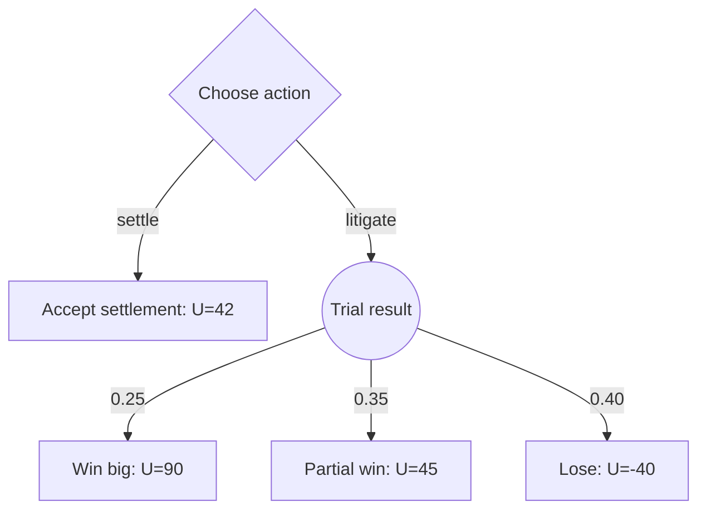

# Raiffa CLI Specification

> Historical tree-CLI design. The proposed successor is
> [Raiffa: auditable decisions from elicited beliefs](docs/spec-v2.md), which
> defines influence diagrams, parameter provenance, agent workflows, integration
> contracts, and staged release gates. The implemented finite 0.2.0 subset is
> documented in [docs/finite-models.md](docs/finite-models.md).

`raiffa` is a JSON-first command-line tool for building, validating, solving, and
stress-testing decision-analysis models in the tradition of Howard Raiffa. It is designed
for agents and humans who need to make assumptions explicit, compare choices under
uncertainty, and preserve reproducible analysis snapshots.

The tool is intentionally modeled on `/Users/jjhorton/tools/voting`: a Typer-based Python
CLI, project-local hidden storage, small JSON entity files, structured JSON output,
structured JSON errors, concise human output behind `--human`, and focused scenario tests.

---

## Goals

- Create a local decision-analysis project that can hold one or more decision models.
- Build decision trees with decision nodes, chance nodes, and terminal outcome nodes.
- Attach probabilities to chance branches and von Neumann-Morgenstern utilities to
  terminal outcomes.
- Solve trees by rollback to identify optimal policies and expected utilities.
- Validate model structure and assumptions before analysis.
- Run sensitivity, threshold, robustness, regret, and value-of-information analyses.
- Preserve every analysis as a reproducible JSON snapshot.
- Keep all commands scriptable by returning structured JSON by default.
- Provide concise human-readable output with `--human`.
- Support later expansion into multiattribute utility, Bayesian updating, and influence
  diagrams without changing the core project contract.

## Non-Goals For V1

- GUI or web UI.
- Collaborative networked persistence.
- Full probabilistic programming.
- Continuous-time decision processes.
- Partially observable Markov decision processes.
- Automatic elicitation of utility functions from interviews.
- Legal, medical, or financial advice. The tool supports analysis; users remain
  responsible for model assumptions and decisions.

---

## Installation And Entrypoint

The package should use a minimal `pyproject.toml` similar to `voting`.

```toml
[project]
name = "raiffa"
version = "0.1.0"
description = "JSON-first CLI for decision analysis"
requires-python = ">=3.11"
dependencies = [
  "rich",
  "typer",
]

[project.optional-dependencies]
dev = ["pytest"]

[project.scripts]
raiffa = "raiffa.cli:main"
```

Local usage:

```bash
pip install -e .
raiffa --help
python -m raiffa.cli --help
```

---

## Project Layout

A Raiffa project is a normal directory containing `.raiffa/meta.json`. Commands find the
project by walking upward from the current directory, or by using `--project <path>`.

```text
lawsuit_analysis/
  .raiffa/
    meta.json
    trees/
    nodes/
    probabilities/
    utilities/
    scenarios/
    analyses/
    reports/
    imports/
    exports/
```

Initial V1 subdirectories:

| Directory | Purpose |
| --- | --- |
| `trees/` | Tree definitions, root node references, status, and model settings. |
| `nodes/` | Decision, chance, and terminal nodes. |
| `probabilities/` | Optional reusable probability assessments and interval assumptions. |
| `utilities/` | Optional utility functions, utility assessments, and attribute models. |
| `scenarios/` | Named variants of a model's probabilities, utilities, or structure. |
| `analyses/` | Result snapshots from solve, sensitivity, VOI, regret, and simulation runs. |
| `reports/` | Human-readable summaries generated from analysis snapshots. |
| `imports/` | Optional raw imported files retained for provenance. |
| `exports/` | Optional exported JSON, Mermaid, Graphviz, Markdown, or CSV files. |

`meta.json`:

```json
{
  "id": "lawsuit_analysis",
  "title": "Lawsuit Analysis",
  "description": "Evaluate whether to settle or litigate.",
  "created_at": "2026-04-16T09:30:00",
  "settings": {
    "default_probability_tolerance": 1e-9,
    "default_criterion": "expected_utility",
    "default_utility_scale": "vnm",
    "analysis_snapshots": true
  }
}
```

---

## Output Contract

Commands return JSON by default:

```json
{
  "data": {},
  "warnings": []
}
```

Human output is opt-in:

```bash
raiffa --human solve lawsuit
```

Errors are structured JSON on stderr:

```json
{
  "error": {
    "code": "validation_error",
    "message": "Chance node probabilities must sum to 1.0.",
    "details": {
      "tree_id": "lawsuit",
      "node_id": "trial_result",
      "sum": 0.9
    }
  }
}
```

Suggested error classes:

| Class | Code | Exit | Meaning |
| --- | --- | ---: | --- |
| `ProjectNotFound` | `missing_project` | 2 | No `.raiffa/meta.json` found. |
| `InvalidProject` | `invalid_project` | 2 | Bad project structure or invalid JSON. |
| `UserError` | `user_error` | 1 | Bad command input, duplicate IDs, or missing entities. |
| `ValidationError` | `validation_error` | 3 | Tree or assumption validation failed. |
| `AnalysisError` | `analysis_error` | 4 | Analysis cannot complete. |
| `ImportError` | `import_error` | 5 | Imported model cannot be parsed or normalized. |

---

## IDs

IDs are file-safe identifiers:

```text
^[a-zA-Z_][a-zA-Z0-9_]*$
```

Examples:

```text
lawsuit
settle
trial_result
win_big
consultant_report
```

Non-examples:

```text
2026_case
trial-result
Trial Result
```

---

## Core Concepts

### Trees

A tree is a decision model with one root node and zero or more named scenarios.

```json
{
  "id": "lawsuit",
  "name": "Settle or Litigate",
  "description": "Evaluate whether to accept settlement or proceed to trial.",
  "created_at": "2026-04-16T09:30:00",
  "status": "draft",
  "root_node": "root",
  "settings": {
    "criterion": "expected_utility",
    "probability_tolerance": 1e-9,
    "utility_scale": "vnm",
    "default_scenario": "base"
  },
  "metadata": {}
}
```

Statuses:

| Status | Meaning |
| --- | --- |
| `draft` | Structure and assumptions are still being edited. |
| `ready` | Validation passes and the model is ready for analysis. |
| `locked` | Structure is fixed; analyses may still be generated. |
| `archived` | Historical record; no mutation except reports/exports. |

### Nodes

All nodes share base fields:

```json
{
  "id": "trial_result",
  "tree_id": "lawsuit",
  "type": "chance",
  "label": "Trial result",
  "description": "Court outcome if litigation proceeds.",
  "created_at": "2026-04-16T09:31:00",
  "parent": "root",
  "branch_label": "litigate",
  "metadata": {}
}
```

Node types:

| Type | Meaning |
| --- | --- |
| `decision` | A choice controlled by the decision maker. |
| `chance` | A move by nature with probabilistic branches. |
| `terminal` | An outcome with utility, payoff, attributes, or all three. |

### Decision Nodes

A decision node chooses the child branch with highest value under the active criterion.

```json
{
  "id": "root",
  "tree_id": "lawsuit",
  "type": "decision",
  "label": "Choose action",
  "parent": null,
  "branch_label": null,
  "decision_maker": "client",
  "metadata": {}
}
```

### Chance Nodes

A chance node contains branch probabilities keyed by child node ID. Probabilities may be
stored directly on the node in V1.

```json
{
  "id": "trial_result",
  "tree_id": "lawsuit",
  "type": "chance",
  "label": "Trial result",
  "parent": "root",
  "branch_label": "litigate",
  "probabilities": {
    "win_big": 0.25,
    "partial_win": 0.35,
    "lose": 0.40
  },
  "metadata": {}
}
```

Future versions may allow probability intervals:

```json
{
  "probabilities": {
    "win_big": {"low": 0.20, "high": 0.35},
    "partial_win": {"low": 0.30, "high": 0.45},
    "lose": {"low": 0.30, "high": 0.50}
  }
}
```

### Terminal Nodes

A terminal node represents a final outcome. V1 requires a scalar vNM utility.

```json
{
  "id": "settlement_outcome",
  "tree_id": "lawsuit",
  "type": "terminal",
  "label": "Accept settlement",
  "parent": "root",
  "branch_label": "settle",
  "utility": 42.0,
  "payoff": {
    "amount": 500000,
    "currency": "USD"
  },
  "attributes": {},
  "metadata": {
    "rationale": "Utility reflects certain payment after fees."
  }
}
```

### Scenarios

A scenario is a named variant of probabilities, utilities, or settings. It can override
base assumptions without duplicating the full tree.

```json
{
  "id": "optimistic",
  "tree_id": "lawsuit",
  "name": "Optimistic Trial Outlook",
  "description": "Higher probability of major win.",
  "created_at": "2026-04-16T09:40:00",
  "overrides": {
    "probabilities": {
      "trial_result": {
        "win_big": 0.40,
        "partial_win": 0.35,
        "lose": 0.25
      }
    },
    "utilities": {
      "lose": -50.0
    }
  }
}
```

---

## Command Surface

### Global Options

```bash
raiffa [--project PATH] [--human] [--quiet] COMMAND
```

| Option | Meaning |
| --- | --- |
| `--project PATH` | Override project root. |
| `--human` | Emit concise human-readable output. |
| `--quiet` | Suppress non-data human output. |

### Project Commands

```bash
raiffa init <project_id> [--title TEXT] [--description TEXT]
raiffa info
```

### Tree Commands

```bash
raiffa tree add <tree_id> <name> [--description TEXT]
raiffa tree list
raiffa tree show <tree_id>
raiffa tree validate <tree_id> [--warnings-as-errors]
raiffa tree status <tree_id> <draft|ready|locked|archived>
raiffa tree copy <source_tree_id> <target_tree_id> [--name TEXT]
raiffa tree delete <tree_id>
```

### Node Commands

```bash
raiffa node add-decision <tree_id> <node_id> <label> \
  [--parent NODE_ID] [--branch-label TEXT]

raiffa node add-chance <tree_id> <node_id> <label> \
  --parent NODE_ID --branch-label TEXT

raiffa node add-terminal <tree_id> <node_id> <label> \
  --parent NODE_ID --branch-label TEXT --utility FLOAT

raiffa node list <tree_id> [--type decision|chance|terminal]
raiffa node show <tree_id> <node_id>
raiffa node move <tree_id> <node_id> --parent NODE_ID --branch-label TEXT
raiffa node rename <tree_id> <node_id> <label>
raiffa node delete <tree_id> <node_id> [--cascade]
raiffa node annotate <tree_id> <node_id> --note TEXT
```

Rules:

- A tree has exactly one root node.
- The first node may omit `--parent`; that node becomes root.
- Non-root nodes require a parent and branch label.
- Node deletion without `--cascade` fails if the node has children.

### Probability Commands

```bash
raiffa prob set <tree_id> <chance_node_id> <child_id>=<probability>...
raiffa prob clear <tree_id> <chance_node_id>
raiffa prob normalize <tree_id> <chance_node_id>
raiffa prob show <tree_id> <chance_node_id>
```

Example:

```bash
raiffa prob set lawsuit trial_result win_big=0.25 partial_win=0.35 lose=0.40
```

V1 probabilities are exact nonnegative floats that must sum to `1.0` within tolerance.

### Utility Commands

```bash
raiffa utility set <tree_id> <terminal_node_id> --utility FLOAT
raiffa utility show <tree_id> <terminal_node_id>
raiffa utility list <tree_id>
```

Optional V1 payoff fields:

```bash
raiffa utility payoff <tree_id> <terminal_node_id> \
  --amount FLOAT [--currency USD]
```

Future utility-function commands:

```bash
raiffa utility function add <function_id> --type linear
raiffa utility function add <function_id> --type exponential --risk-tolerance FLOAT
raiffa utility apply <tree_id> --function <function_id> --payoff-field amount
raiffa utility certainty-equivalent <tree_id> <node_id>
```

### Solve Commands

```bash
raiffa solve <tree_id> [--scenario SCENARIO_ID] [--no-write]
raiffa solve <tree_id> --show-policy
raiffa solve <tree_id> --explain
```

V1 solve criterion:

| Criterion | Meaning |
| --- | --- |
| `expected_utility` | Chance nodes compute probability-weighted values; decision nodes choose the maximum-value child. |

Solve output:

```json
{
  "data": {
    "analysis_id": "solve_20260416_093200",
    "tree_id": "lawsuit",
    "scenario_id": "base",
    "criterion": "expected_utility",
    "root_node": "root",
    "root_value": 42.0,
    "recommended_action": "settlement_outcome",
    "policy": {
      "root": "settlement_outcome"
    },
    "node_values": {
      "root": 42.0,
      "settlement_outcome": 42.0,
      "trial_result": 22.25,
      "win_big": 90.0,
      "partial_win": 45.0,
      "lose": -40.0
    },
    "dominated_branches": [
      {
        "decision_node": "root",
        "branch": "trial_result",
        "value": 22.25,
        "best_value": 42.0
      }
    ]
  },
  "warnings": []
}
```

### Scenario Commands

```bash
raiffa scenario add <tree_id> <scenario_id> <name> [--description TEXT]
raiffa scenario list <tree_id>
raiffa scenario show <tree_id> <scenario_id>
raiffa scenario set-prob <tree_id> <scenario_id> <chance_node_id> <child_id>=<probability>...
raiffa scenario set-utility <tree_id> <scenario_id> <terminal_node_id> --utility FLOAT
raiffa scenario diff <tree_id> <left_scenario_id> <right_scenario_id>
raiffa scenario delete <tree_id> <scenario_id>
```

### Sensitivity Commands

```bash
raiffa sensitivity one-way <tree_id> \
  --param probability:<chance_node_id>.<child_id> \
  --from FLOAT --to FLOAT [--steps INT]

raiffa sensitivity one-way <tree_id> \
  --param utility:<terminal_node_id> \
  --from FLOAT --to FLOAT [--steps INT]

raiffa sensitivity threshold <tree_id> \
  --param probability:<chance_node_id>.<child_id> \
  --between <branch_a> <branch_b>

raiffa sensitivity tornado <tree_id>
```

One-way sensitivity output should include:

- sampled parameter values
- root expected utility at each sample
- recommended action at each sample
- threshold points where the recommended action changes
- warnings when probability changes require proportional adjustment of siblings

Default probability adjustment rule:

- When one child probability changes, remaining sibling probabilities are rescaled
  proportionally to preserve total probability mass.
- If sibling mass is zero, the command fails unless explicit sibling values are provided.

### Value-Of-Information Commands

```bash
raiffa voi evpi <tree_id> [--chance NODE_ID]
raiffa voi evppi <tree_id> --chance NODE_ID
```

Definitions:

| Command | Meaning |
| --- | --- |
| `evpi` | Expected value of perfect information over all unresolved chance uncertainty. |
| `evppi` | Expected value of perfect information for one chance node. |

V1 should support EVPI/EVPPI for finite chance nodes in decision trees. Future versions
may support imperfect sample information.

Future sample-information commands:

```bash
raiffa signal add <tree_id> <signal_id> --states STATE... --signals SIGNAL...
raiffa signal likelihood <tree_id> <signal_id> <signal>:<state>=<probability>...
raiffa voi evsi <tree_id> --signal SIGNAL_ID [--cost FLOAT]
```

### Regret And Robustness Commands

```bash
raiffa regret <tree_id>
raiffa regret <tree_id> --criterion minimax
raiffa robust <tree_id>
```

V1 regret report:

- expected regret by root action
- maximum regret by root action when terminal outcomes are comparable
- minimax-regret recommendation

Robustness is V2 unless probability intervals are implemented in V1.

### Dominance Commands

```bash
raiffa dominance <tree_id>
```

Checks:

- decision branches that are strictly worse than another branch under current assumptions
- terminal outcomes with equal utility that can be merged
- branches with zero probability
- unreachable nodes

### Import And Export Commands

```bash
raiffa import json <path> [--tree-id TREE_ID]
raiffa export json <tree_id> [--output PATH]
raiffa export mermaid <tree_id> [--output PATH]
raiffa export dot <tree_id> [--output PATH]
raiffa export markdown <tree_id> [--output PATH]
raiffa export terminals <tree_id> [--format csv] [--output PATH]
```

Mermaid export should generate a decision-tree diagram:



### Analysis Snapshot Commands

```bash
raiffa analysis list [<tree_id>]
raiffa analysis show <analysis_id>
raiffa analysis delete <analysis_id>
```

Analysis snapshot:

```json
{
  "id": "solve_20260416_093200",
  "type": "solve",
  "tree_id": "lawsuit",
  "scenario_id": "base",
  "created_at": "2026-04-16T09:32:00",
  "inputs": {
    "criterion": "expected_utility"
  },
  "result": {},
  "warnings": []
}
```

---

## Validation Rules

`raiffa tree validate <tree_id>` should perform structural and semantic validation.

Structural validation:

- Tree exists.
- Root node exists.
- Root has no parent.
- Every non-root node has exactly one parent.
- Every referenced parent exists.
- No cycles.
- Every node is reachable from the root.
- Decision and chance nodes have at least one child.
- Terminal nodes have no children.
- Sibling branch labels are unique under the same parent.

Probability validation:

- Every chance node has a probability for each child.
- Chance node probabilities are numeric.
- Chance node probabilities are nonnegative.
- Chance node probabilities sum to `1.0` within tree tolerance.
- Probability keys reference actual children of the chance node.
- No child of a chance node is missing from the probability map.

Utility validation:

- Every terminal node has a scalar utility in V1.
- Utilities are numeric.
- Payoff currency is consistent within a tree when payoff is used.
- Warnings are emitted when terminals mix utility-only and payoff-only fields.

Scenario validation:

- Scenario overrides reference existing nodes.
- Scenario probability overrides preserve child sets.
- Scenario probability overrides sum to `1.0`.
- Scenario utility overrides apply only to terminal nodes.

Analysis validation:

- Solve requires a valid tree.
- Sensitivity requires a valid tree and a recognized parameter.
- VOI requires finite chance nodes and scalar utilities.
- Regret requires comparable terminal utilities.

---

## Rollback Algorithm

For V1 expected-utility rollback:

1. Validate the tree.
2. Traverse nodes in postorder from terminals to root.
3. Terminal node value is its utility.
4. Chance node value is:

```text
sum(probability(child) * value(child) for child in children)
```

5. Decision node value is:

```text
max(value(child) for child in children)
```

6. The policy records every value-maximizing child at each decision node.
7. If a tie occurs, include all tied branches unless a tie policy is configured.
8. Store an analysis snapshot unless `--no-write` is provided.

Tie policy options:

| Policy | Meaning |
| --- | --- |
| `all` | Return all tied optimal branches. Default. |
| `lexicographic` | Choose the lowest ID among tied branches. |
| `first_created` | Choose the earliest created tied branch. |

---

## Sensitivity Semantics

Sensitivity analysis should not mutate the base tree. It creates an analysis snapshot with
sampled assumptions and resulting recommendations.

Parameter address formats:

```text
probability:<chance_node_id>.<child_node_id>
utility:<terminal_node_id>
payoff:<terminal_node_id>.amount
```

Probability sensitivity must preserve probability mass. V1 should use proportional
rescaling of siblings:

```text
new_sibling_probability =
  old_sibling_probability * ((1 - new_target_probability) / old_sibling_mass)
```

If old sibling mass is zero, proportional rescaling is undefined and the command fails.

Threshold analysis should return the approximate point where the preferred root action
changes. If there is no threshold in the provided range, return a structured result saying
so rather than failing.

---

## Value Of Information Semantics

EVPI is the difference between:

- expected value when the decision maker can choose after uncertainty is resolved
- expected value under the current optimal policy

EVPPI for a chance node is the expected gain from observing that chance node's state before
making relevant decisions.

V1 can implement VOI by tree transformation or direct enumeration, as long as the result is
consistent for finite decision trees.

VOI output:

```json
{
  "data": {
    "analysis_id": "evppi_20260416_094000",
    "tree_id": "lawsuit",
    "chance_node": "trial_result",
    "current_value": 42.0,
    "value_with_information": 55.05,
    "expected_value_of_information": 13.05
  },
  "warnings": []
}
```

---

## Worked Example

```bash
raiffa init lawsuit_analysis --title "Lawsuit Analysis"
cd lawsuit_analysis

raiffa tree add lawsuit "Settle or Litigate" \
  --description "Evaluate whether to settle or go to trial."

raiffa node add-decision lawsuit root "Choose action"

raiffa node add-terminal lawsuit settle_outcome "Accept settlement" \
  --parent root \
  --branch-label settle \
  --utility 42

raiffa node add-chance lawsuit trial_result "Trial result" \
  --parent root \
  --branch-label litigate

raiffa node add-terminal lawsuit win_big "Win big" \
  --parent trial_result \
  --branch-label "major win" \
  --utility 90

raiffa node add-terminal lawsuit partial_win "Partial win" \
  --parent trial_result \
  --branch-label "partial win" \
  --utility 45

raiffa node add-terminal lawsuit lose "Lose" \
  --parent trial_result \
  --branch-label lose \
  --utility -40

raiffa prob set lawsuit trial_result win_big=0.25 partial_win=0.35 lose=0.40

raiffa tree validate lawsuit
raiffa solve lawsuit --show-policy
raiffa sensitivity one-way lawsuit \
  --param probability:trial_result.win_big \
  --from 0.10 \
  --to 0.60 \
  --steps 11
raiffa voi evppi lawsuit --chance trial_result
raiffa export mermaid lawsuit
```

Expected solve:

```json
{
  "data": {
    "tree_id": "lawsuit",
    "root_value": 42.0,
    "recommended_action": "settle_outcome",
    "policy": {
      "root": ["settle_outcome"]
    },
    "node_values": {
      "root": 42.0,
      "settle_outcome": 42.0,
      "trial_result": 22.25,
      "win_big": 90.0,
      "partial_win": 45.0,
      "lose": -40.0
    }
  },
  "warnings": []
}
```

---

## V1 Implementation Plan

V1 should ship as a complete vertical slice:

1. Project initialization and discovery.
2. JSON output and structured errors.
3. Tree CRUD.
4. Node CRUD for decision, chance, and terminal nodes.
5. Probability assignment.
6. Utility assignment.
7. Tree validation.
8. Expected-utility rollback.
9. Analysis snapshots.
10. Scenario creation and scenario overrides.
11. One-way sensitivity.
12. Threshold sensitivity.
13. EVPI or EVPPI for finite chance nodes.
14. Mermaid and JSON export.
15. Scenario tests covering complete workflows.

V1 can defer:

- multiattribute utility
- utility function fitting
- Bayesian updating
- imperfect sample information / EVSI
- probability intervals
- Monte Carlo simulation
- influence diagrams
- Graphviz and Markdown export

---

## Test Scenarios

Recommended tests:

| Test | Purpose |
| --- | --- |
| `test_init_info` | Project creation and discovery. |
| `test_lawsuit_solve` | Build a tree and solve expected utility. |
| `test_invalid_probability_sum` | Validation fails on bad chance probabilities. |
| `test_missing_terminal_utility` | Validation fails on incomplete terminal node. |
| `test_decision_policy_tie` | Tied decision branches return both optimal branches. |
| `test_scenario_override_changes_choice` | Scenario probabilities can alter the recommendation. |
| `test_one_way_sensitivity` | Sensitivity samples produce expected policy changes. |
| `test_threshold` | Threshold analysis identifies a crossing point. |
| `test_evppi` | Perfect information value is nonnegative and matches fixture. |
| `test_mermaid_export` | Export includes all nodes and branch labels. |

---

## Design Principles

- Prefer explicit assumptions over implicit defaults.
- Preserve user-entered assumptions and analysis outputs as auditable JSON.
- Make validation strict enough that analysis results are trustworthy.
- Make warnings useful for model repair.
- Keep the domain model simple in V1, but avoid choices that block utility functions,
  multiattribute utility, scenarios, and VOI later.
- Treat expected utility as the default decision criterion, not the only possible lens.
- Keep commands small and composable so agents can build and revise models incrementally.
